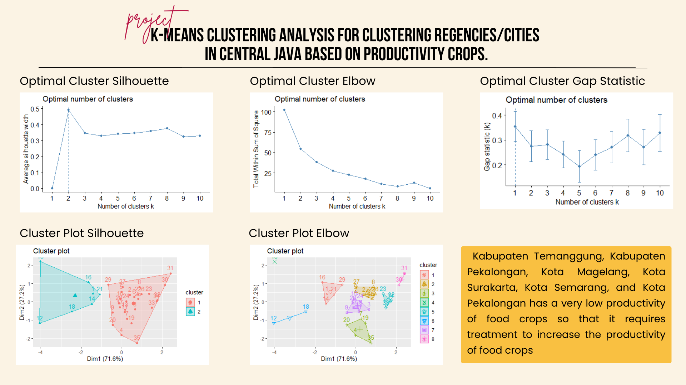
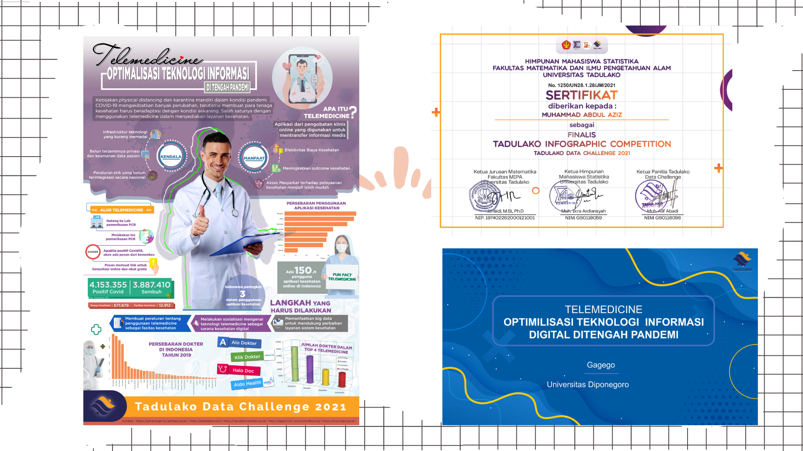

# Portofolio
---
## Predicting - S1 Thesis Project
My thesis, "Predicting Potential Pawn Customers at PT Pegadaian Using a Support Vector Machine with a Genetic Algorithm". I explore the intersection of advanced data analysis and customer targeting strategies. By leveraging Support Vector Machines and Genetic Algorithms, this research aims to revolutionize PT Pegadaian's approach to identifying potential customers. (Aziz, 2023)

## Home Credit Default Risk
Our final independent project Study Independent at Zenius, we delved into the Home Credit dataset. Together, we meticulously preprocessed a substantial dataset comprising 300,000 credit applications. We constructed sophisticated machine learning models designed to predict Home Credit default risk and developed an intuitive dashboard with interactive visualizations, empowering stakeholders to monitor and assess nasabah data effectively.
 

<iframe src="https://tautan-presentasi-anda](https://docs.google.com/presentation/d/1xVXuIx1hnc-WG_YNuIPnmQpzY558-pQn/edit?usp=sharing&ouid=114387581804678914451&rtpof=true&sd=true" width="100%" height="500" frameborder="0" allowfullscreen="true"></iframe>

## Multinomial Logistic Regression
My complete projects in Pendanaan Pengabdian Mahasiswa Faculty of Science and Mathematics Diponegoro University (Aziz et al,2022)

## K-Means Clustering 
K-Means Clustering analysis for Central Java's regencies/cities, based on crop productivity, aims to reveal regional agricultural patterns. This data-driven approach helps policymakers allocate resources more effectively, enhancing productivity and sustainability.
 

## K-Nearest Neighbour (KNN) and Fuzzy K-Nearest Neighbour (FKNN)
Conducting K-Nearest Neighbour (KNN) and Fuzzy K-Nearest Neighbour (FKNN) analyses for heart attacks to refine prediction accuracy and explore the nuances of fuzzy logic in medical diagnostics

---
## Finalis Tadulako Data Challenge 2021
My Team achieved recognition as an infographic finalist at the Tadulako Data Challenge by presenting an informative infographic on the topic of telemedicine's pivotal role during the Covid-19 pandemic. This experience showcased my ability to effectively convey complex information visually, highlighting the significance of telemedicine in providing accessible healthcare solutions during challenging times.
 

© 2020 Khanh Tran. Powered by Jekyll and the Minimal Theme.

