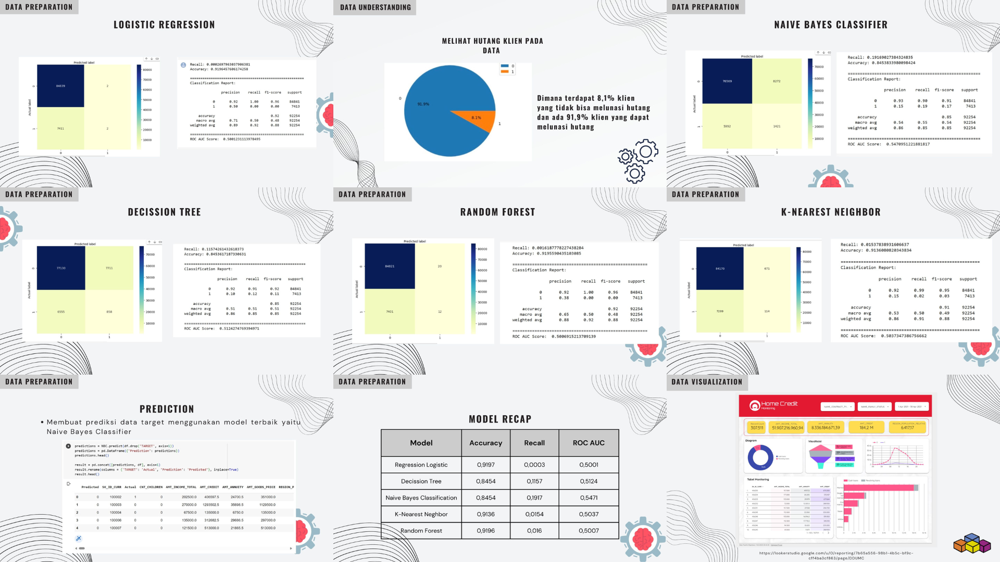

# Portofolio
---
## Multinomial Logistic Regression

My complete projects in Pendanaan Pengabdian Mahasiswa Faculty of Science and Mathematics Diponegoro University (Aziz et al,2022)

## Support Vector Machine with Genetic Algorithm

My thesis is on the topic of Predicting Potential Pawn Customers at PT Pegadaian Using a Support Vector Machine with a Genetic Algorithm (Aziz, 2023)

## Home Credit Default Risk
Final Project Study Independent at Zenius about Dataset Home Credit. My team preprocessed a dataset of 300K credit applications and built machine learning models to predict Home Credit default risk.
 

---
## Finalis Tadulako Data Challenge 2021
Became an infographic finalist at the Tadulako Data Challenge by presenting the topic of telemedicine during the Covid19 pandemic.
 

© 2020 Khanh Tran. Powered by Jekyll and the Minimal Theme.

